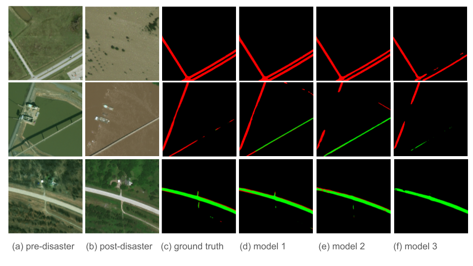
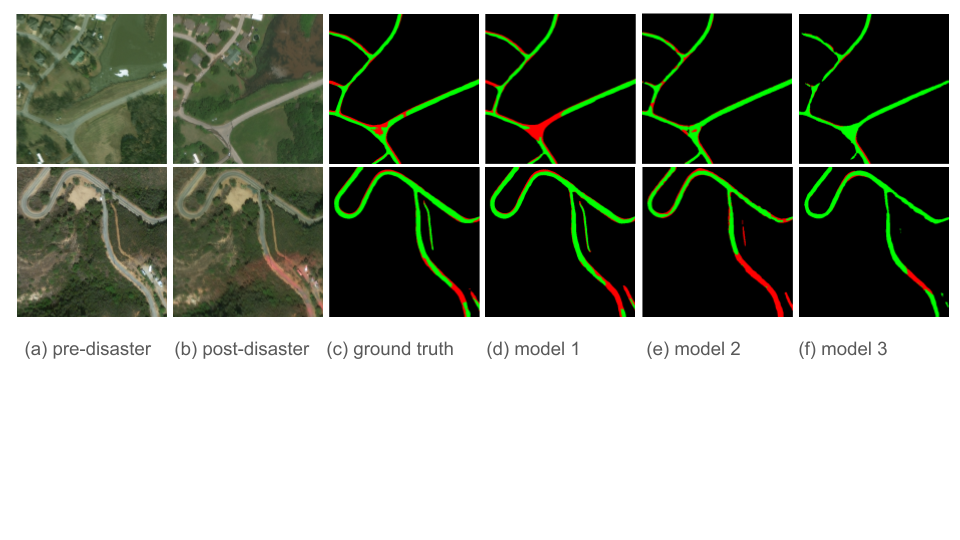

# xBD Road Damage Assessment

이 저장소는 **xBD** 데이터를 활용하여 도로(road)의 손상평가 모델을 수행하는 딥러닝 모델 구현 코드를 포함합니다.  
본 프로젝트는 데이터 전처리, 모델 학습, 평가 및 추론까지 전체 파이프라인을 제공합니다.

## 목차

- [프로젝트 개요](#프로젝트-개요)
- [주요 특징](#주요-특징)
- [요구사항](#요구사항)
- [설치 방법](#설치-방법)
- [데이터셋](#데이터셋)
- [사용 방법](#사용-방법)
- [실험 결과](#실험-결과)
- [기여 방법](#기여-방법)
- [라이선스](#라이선스)
- [참고 자료](#참고-자료)

## 프로젝트 개요

이 프로젝트는 xBD 데이터셋을 활용하여 도로 손상평가 모델을 구현합니다.  
해당 모델은 도로 손상평가에 초점을 두고 있지만 도로 검출(semantic segmentation)도 수행하고 있습니다.
모델은 딥러닝 기반 네트워크(PyTorch)를 사용하며, 다양한 전처리 및 데이터 증강 기법을 적용하여 학습 성능을 향상시키고자 합니다.

## 주요 특징

- **End-to-End Pipeline:** 데이터 전처리부터 모델 학습, 평가, 추론까지 전체 워크플로우 제공
- **모듈화 설계:** 각 모듈(데이터 로더, 모델, 학습 스크립트 등)이 독립적으로 구성되어 확장이 용이함
- **사용자 친화적 구성:** 구성 파일(config.yaml 등)을 통한 하이퍼파라미터 및 경로 설정
- **GPU 지원:** CUDA 지원을 통해 빠른 학습 환경 제공
- **다양한 모델 아키텍처:** UNet과 SiameseDiffUNet 모델 지원

## 요구사항

- Python 3.8 이상
- PyTorch
- CUDA (GPU 사용 시)
- 기타 Python 라이브러리: numpy, opencv-python, albumentations, matplotlib 등  
  *(자세한 내용은 `pyproject.toml` 참조)*

## 설치 방법

1. 저장소 클론:
   ```bash
   git clone https://github.com/seunghyeokleeme/xBD_road_damage_assessment.git
   cd xBD_road_damage_assessment
   ```

2. 가상환경 생성 및 활성화 (선택 사항):
   ```bash
   # Python venv 사용 시
   python3 -m venv venv
   source venv/bin/activate  # Linux/Mac
   venv\Scripts\activate     # Windows

   # uv venv 사용 시
   uv venv
   ```

## 데이터셋

xBD 데이터셋을 사용합니다. 데이터셋은 다음과 같이 구성되어야 합니다:

**참고:** 해당 프로젝트는 building이 아닌 road를 이미지 분할을 하기 때문에 직접 레이블링이 필요합니다.

```
datasets/
├── train/
│   ├── images/
│   │   ├── xxx_pre_disaster.png
│   │   └── xxx_post_disaster.png
│   └── targets/
│       └── xxx_post_disaster_target.png
├── hold/
│   ├── images/
│   └── targets/
└── test/
    ├── images/
    └── targets/
```

### 데이터셋 다운로드 방법

1. xBD 데이터셋은 [xBD 공식 페이지](https://xview2.org)에서 다운로드하여 직접 road를 labeling을 수행합니다.
2. 또는 [구글드라이브 링크](https://drive.google.com/drive/folders/1Kd329puBn5_Nc_3Lg5READct4Whd7erR)에서 road labeling이 완료된 데이터셋을 다운로드할 수 있습니다. (추천)

## 사용 방법

### 1. 데이터 전처리
```bash
python3 ./data_read.py
```

### 2. TensorBoard 실행
```bash
tensorboard --logdir='./log'
```

### 3. 모델 타입 선택
학습 및 테스트 시 `--model_type` 옵션을 통해 사용할 모델을 선택할 수 있습니다:

- `"UNet"`: 기본 UNet 모델
  - `SingleDiffDataset` 클래스를 사용하여 차분 이미지 생성
  - 재난 전/후 이미지의 차이를 계산하여 도로 손상 평가
- `"SiameseDiffUNet"`: Siamese 구조를 활용한 UNet 모델
  - `FusionChangeDataset` 클래스를 사용하여 재난 전/후 이미지를 별도로 처리
  - Siamese 구조를 통해 두 시점의 특징을 추출 및 융합

### 4. 모델 학습
```bash
python3 ./train.py \
  --lr 1e-3 \
  --batch_size 12 \
  --num_epoch 50 \
  --data_dir "./datasets_512" \
  --ckpt_dir "./checkpoint_v1" \
  --log_dir "./log/exp1" \
  --result_dir "./results_v1" \
  --mode "train" \
  --model_type "UNet" \
  --train_continue "off"
```

### 5. 모델 테스트
```bash
python3 ./train.py \
  --lr 1e-3 \
  --batch_size 12 \
  --num_epoch 50 \
  --data_dir "./datasets_512" \
  --ckpt_dir "./checkpoint_v1" \
  --log_dir "./log/exp1" \
  --result_dir "./results_v1" \
  --mode "test" \
  --model_type "UNet" \
  --train_continue "off"
```

### 6. 모델 평가
```bash
python3 ./eval.py \
  --result_dir "./results_v1" \
  --out_fp "./localization_metrics.json"
```

## 실험 결과

### 실험 모델 설명

1. **실험 1 (도로 검출 시멘틱 세그멘테이션)**
   - 재난 전/후 이미지를 각각 추론 후 오버레이하여 손상평가
   - [xBD_road_segmentation](https://github.com/seunghyeokleeme/xBD_road_segmentation.git) 참조

2. **실험 2 (UNet 기반)**
   - `SingleDiffDataset` 클래스를 통해 재난 전/후 이미지의 차분 이미지 생성
   - 차분 이미지 생성 과정:
     1. 재난 전 이미지(pre_image)와 재난 후 이미지(post_image) 로드
     2. 두 이미지에 대해 transform 적용 (전처리)
     3. 텐서로 변환된 후, 재난 후 이미지에서 재난 전 이미지를 빼서 차분 이미지 생성 (`diff_image = post_image - pre_image`)
   - 생성된 차분 이미지를 입력으로 사용하여 3진 세그멘테이션 수행 (배경/정상 도로/손상도로)
   - 차분 이미지의 의미:
     - 값이 0에 가까운 부분: 변화가 없는 영역 (배경 또는 정상 도로)
     - 값이 큰 부분: 변화가 큰 영역 (손상된 도로)

3. **실험 3 (SiameseDiffUNet)**
   - `FusionChangeDataset` 클래스를 통해 재난 전/후 이미지를 별도로 입력
   - Siamese 구조를 활용하여 두 시점의 특징을 동일한 공간에서 추출
   - 특징 융합(혹은 차분) 후 디코더에서 도로 손상 평가 수행

### 성능 비교

| Metric | 실험 1 | 실험 2 | 실험 3 |
|--------|--------|--------|--------|
| Overall F1 (F1s) | 0.262 | 0.598 | 0.481 |
| Localization F1 (F1b) | 0.874 | 0.750 | 0.667 |
| Damage Assessment F1 (F1d) | X | 0.533 | 0.401 |

### 결과 시각화





자세한 실험 결과는 다음 파일에서 확인할 수 있습니다:
- 실험 2: `localization_metrics.json`
- 실험 3: `localization_metrics_v2.json`

## 기여 방법

1. 저장소를 Fork 합니다.
2. 새로운 브랜치를 생성 (`git checkout -b feature/YourFeature`).
3. 코드를 수정 및 개선합니다.
4. 변경사항을 커밋 (`git commit -m 'Add some feature'`).
5. 원격 저장소에 Push (`git push origin feature/YourFeature`).
6. Pull Request를 생성합니다.

## 라이선스

이 프로젝트는 [MIT 라이선스](LICENSE) 하에 배포됩니다.

## 참고 자료

- [xBD 공식 페이지](https://xview2.org)
- [PyTorch Documentation](https://pytorch.org/docs/)
- [Unet: Convolutional Networks for Biomedical Image Segmentation](https://arxiv.org/abs/1505.04597)
- Gupta, R. et al. (2019). "xBD: A dataset for assessing building damage from satellite imagery." *arXiv preprint arXiv:1911.09296*. [arXiv](https://arxiv.org/abs/1911.09296)
- Alisjahbana, I. et al. (2024). "DeepDamageNet: A two-step deep-learning model for multi-disaster building damage segmentation and classification using satellite imagery." *arXiv preprint arXiv:2405.04800*. [arXiv](https://arxiv.org/abs/2405.04800)

