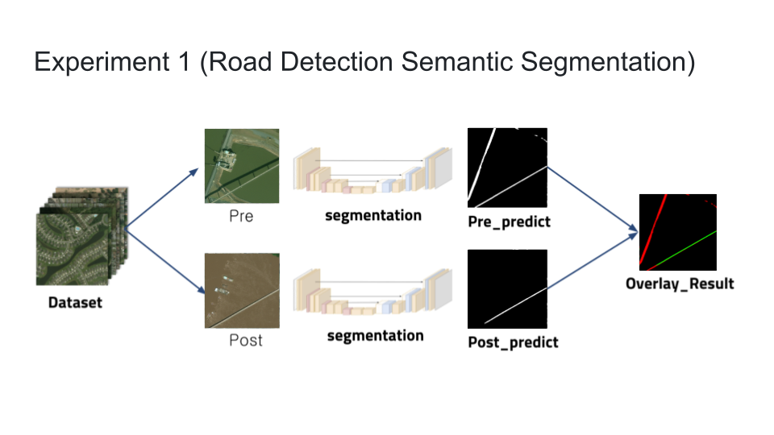
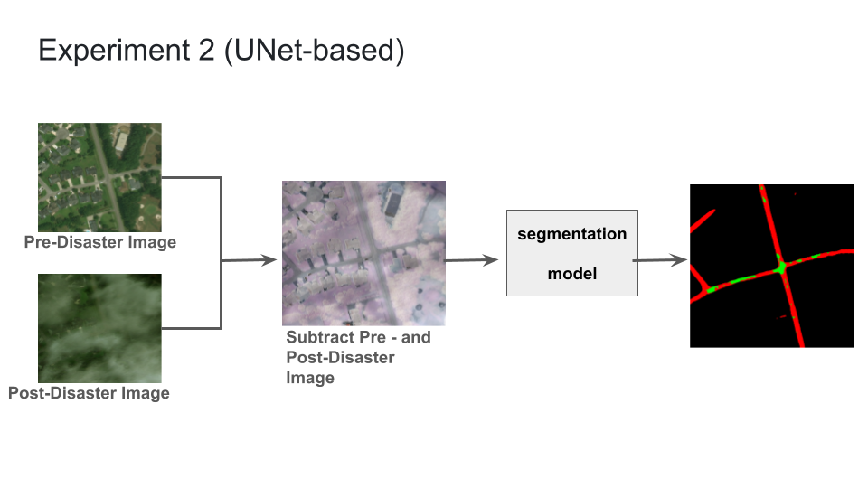
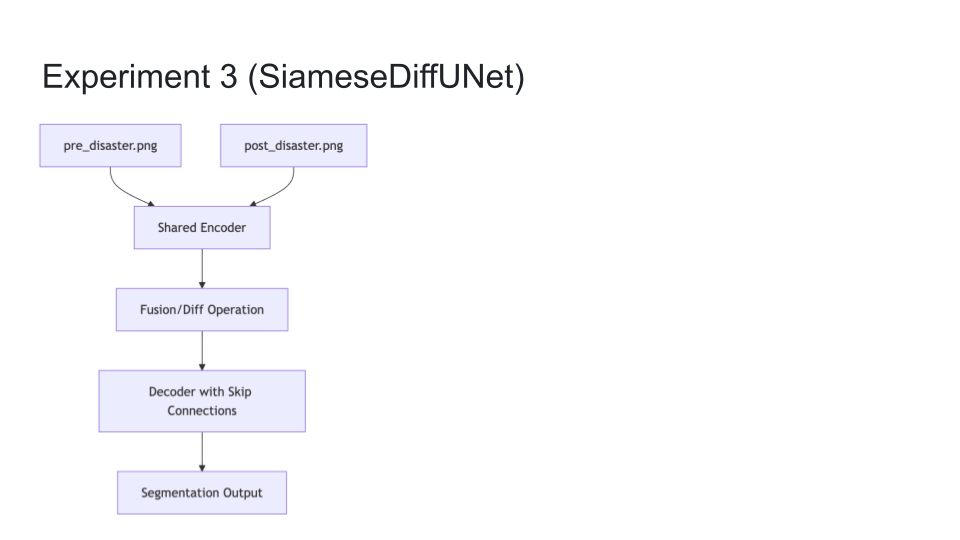
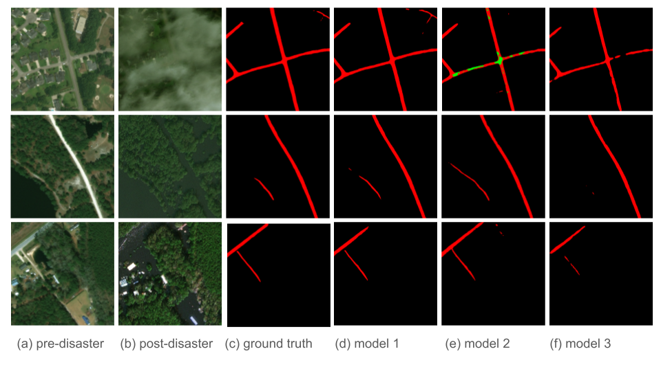

# xBD Road Damage Assessment

This repository contains the implementation code for a deep learning model that performs road damage assessment using **xBD** data.  
The project provides a complete pipeline from data preprocessing to model training, evaluation, and inference.

## Table of Contents

- [Project Overview](#project-overview)
- [Key Features](#key-features)
- [Requirements](#requirements)
- [Installation](#installation)
- [Dataset](#dataset)
- [Usage](#usage)
- [Experimental Results](#experimental-results)
- [How to Contribute](#how-to-contribute)
- [License](#license)
- [References](#references)

## Project Overview

This project implements a road damage assessment model using the xBD dataset.  
While the model primarily focuses on road damage assessment, it also performs road detection (semantic segmentation).
The model uses a deep learning-based network (PyTorch) and applies various preprocessing and data augmentation techniques to enhance learning performance.

## Key Features

- **End-to-End Pipeline:** Provides a complete workflow from data preprocessing to model training, evaluation, and inference
- **Modular Design:** Each module (data loader, model, training script, etc.) is independently structured for easy extension
- **User-Friendly Configuration:** Hyperparameters and path settings through configuration files (config.yaml, etc.)
- **GPU Support:** Fast training environment through CUDA support
- **Diverse Model Architectures:** Supports both UNet and SiameseDiffUNet models

## Requirements

- Python 3.8 or higher
- PyTorch
- CUDA (for GPU usage)
- Other Python libraries: numpy, opencv-python, albumentations, matplotlib, etc.  
  *(See `pyproject.toml` for details)*

## Installation

1. Clone the repository:
   ```bash
   git clone https://github.com/seunghyeokleeme/xBD_road_damage_assessment.git
   cd xBD_road_damage_assessment
   ```

2. Create and activate virtual environment (optional):
   ```bash
   # Using Python venv
   python3 -m venv venv
   source venv/bin/activate  # Linux/Mac
   venv\Scripts\activate     # Windows

   # Using uv venv
   uv venv
   ```

## Dataset

The project uses the xBD dataset. The dataset should be structured as follows:

**Note:** Since this project focuses on road segmentation rather than building segmentation, manual labeling is required.

```
datasets/
├── train/
│   ├── images/
│   │   ├── xxx_pre_disaster.png
│   │   └── xxx_post_disaster.png
│   └── targets/
│       └── xxx_post_disaster_target.png
├── hold/
│   ├── images/
│   └── targets/
└── test/
    ├── images/
    └── targets/
```

### Dataset Download Methods

1. Download the xBD dataset from the [official xBD page](https://xview2.org) and perform road labeling manually.
2. Alternatively, download the pre-labeled road dataset from [Google Drive link](https://drive.google.com/drive/folders/1Kd329puBn5_Nc_3Lg5READct4Whd7erR). (Recommended)

## Usage

### 1. Data Preprocessing
```bash
python3 ./data_read.py
```

### 2. Run TensorBoard
```bash
tensorboard --logdir='./log'
```

### 3. Model Type Selection
You can select the model during training and testing using the `--model_type` option:

- `"UNet"`: Basic UNet model
  - Uses `SingleDiffDataset` class to generate difference images
  - Calculates the difference between pre- and post-disaster images for road damage assessment
- `"SiameseDiffUNet"`: UNet model utilizing Siamese structure
  - Uses `FusionChangeDataset` class to process pre- and post-disaster images separately
  - Extracts and fuses features from both time points using Siamese structure

### 4. Model Training
```bash
python3 ./train.py \
  --lr 1e-3 \
  --batch_size 12 \
  --num_epoch 50 \
  --data_dir "./datasets_512" \
  --ckpt_dir "./checkpoint_v1" \
  --log_dir "./log/exp1" \
  --result_dir "./results_v1" \
  --mode "train" \
  --model_type "UNet" \
  --train_continue "off"
```

### 5. Model Testing
```bash
python3 ./train.py \
  --lr 1e-3 \
  --batch_size 12 \
  --num_epoch 50 \
  --data_dir "./datasets_512" \
  --ckpt_dir "./checkpoint_v1" \
  --log_dir "./log/exp1" \
  --result_dir "./results_v1" \
  --mode "test" \
  --model_type "UNet" \
  --train_continue "off"
```

### 6. Model Evaluation
```bash
python3 ./eval.py \
  --result_dir "./results_v1" \
  --out_fp "./localization_metrics.json"
```

## Experimental Results

### Experimental Model Descriptions

1. **Experiment 1 (Road Detection Semantic Segmentation)**
   - Performs inference on pre- and post-disaster images separately and overlays them for damage assessment
   - Refer to [xBD_road_segmentation](https://github.com/seunghyeokleeme/xBD_road_segmentation.git)
   - model archarchitecture: 

2. **Experiment 2 (UNet-based)**
   - Generates difference images using the `SingleDiffDataset` class
   - Difference image generation process:
     1. Load pre-disaster image (pre_image) and post-disaster image (post_image)
     2. Apply transforms to both images
     3. Create difference image by subtracting pre-disaster image from post-disaster image (`diff_image = post_image - pre_image`)
   - Uses the generated difference image as input for 3-class segmentation (background/normal road/damaged road)
   - Meaning of difference image:
     - Values close to zero: Unchanged areas (background or normal road)
     - Larger values: Areas with significant changes (damaged road)
   - model archarchitecture: 

3. **Experiment 3 (SiameseDiffUNet)**
   - Uses `FusionChangeDataset` class to input pre- and post-disaster images separately
   - Extracts features from both time points in the same space using Siamese structure
   - Performs road damage assessment in the decoder after feature fusion (or difference)
   - model archarchitecture: 

### Performance Comparison

| Metric | Experiment 1 | Experiment 2 | Experiment 3 |
|--------|-------------|-------------|-------------|
| Overall F1 (F1s) | 0.262 | 0.598 | 0.481 |
| Localization F1 (F1b) | 0.874 | 0.750 | 0.667 |
| Damage Assessment F1 (F1d) | X | 0.533 | 0.401 |

### Result Visualization





Detailed experimental results can be found in the following files:
- Experiment 2: `localization_metrics.json`
- Experiment 3: `localization_metrics_v2.json`

## How to Contribute

1. Fork the repository.
2. Create a new branch (`git checkout -b feature/YourFeature`).
3. Modify and improve the code.
4. Commit your changes (`git commit -m 'Add some feature'`).
5. Push to the remote repository (`git push origin feature/YourFeature`).
6. Create a Pull Request.

## License

This project is distributed under the [MIT License](LICENSE).

## References

- [xBD Official Page](https://xview2.org)
- [PyTorch Documentation](https://pytorch.org/docs/)
- [Unet: Convolutional Networks for Biomedical Image Segmentation](https://arxiv.org/abs/1505.04597)
- Gupta, R. et al. (2019). "xBD: A dataset for assessing building damage from satellite imagery." *arXiv preprint arXiv:1911.09296*. [arXiv](https://arxiv.org/abs/1911.09296)
- Alisjahbana, I. et al. (2024). "DeepDamageNet: A two-step deep-learning model for multi-disaster building damage segmentation and classification using satellite imagery." *arXiv preprint arXiv:2405.04800*. [arXiv](https://arxiv.org/abs/2405.04800) 
